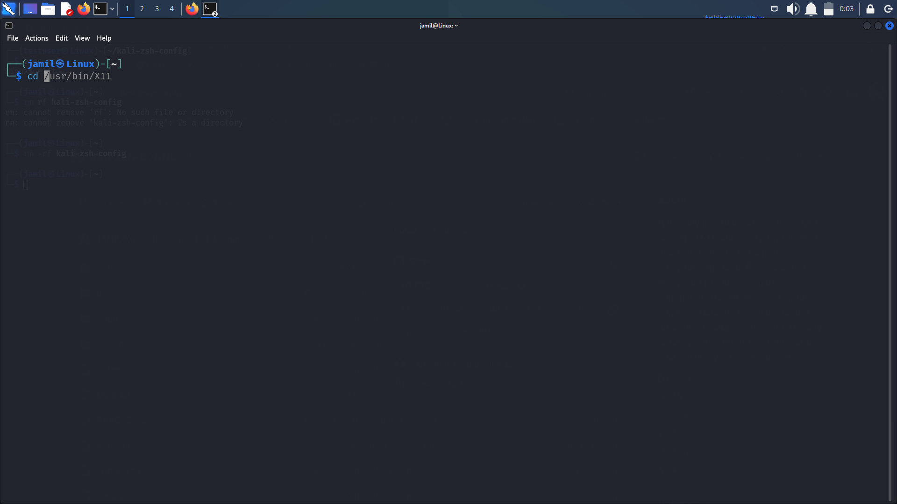
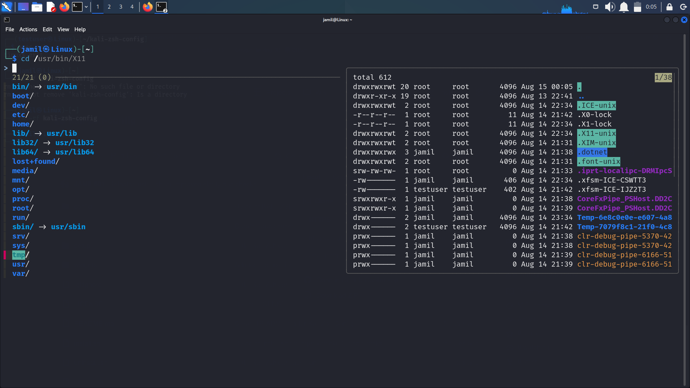
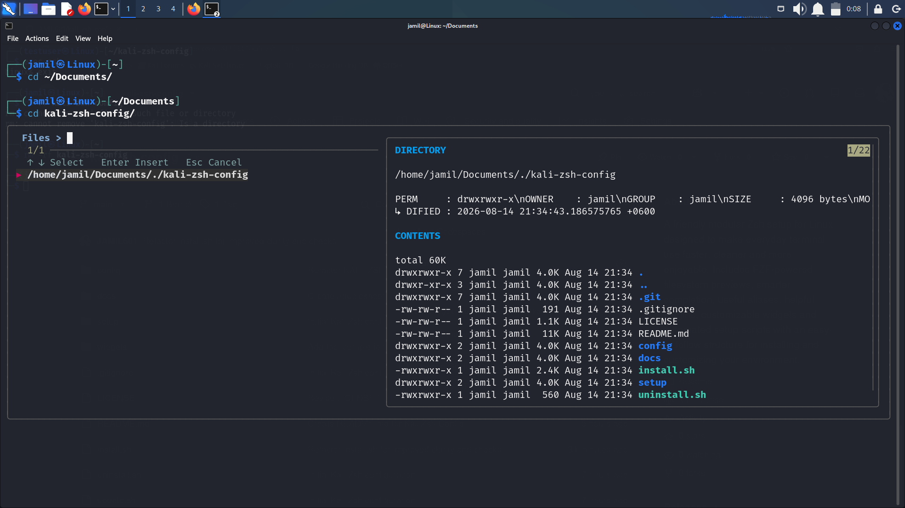
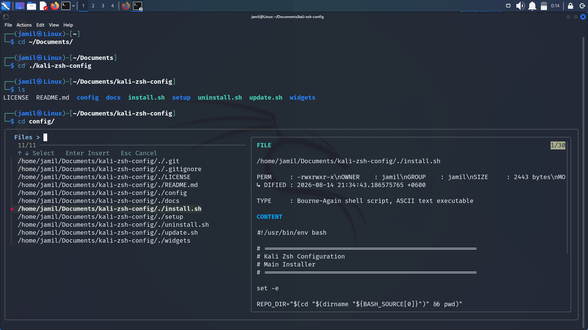

# Kali Zsh Config

A modular, practical, and customizable Zsh configuration designed primarily for Kali Linux and other Debian-based Linux distributions.



This project provides an organized terminal environment with improved completion, fzf-tab integration, autosuggestions, syntax highlighting, filesystem previews, useful aliases, and modular Zsh widgets.

The project is designed so that the complete configuration can be backed up, installed, updated, customized, removed, and deployed on another machine without manually rebuilding the configuration from scratch.

---

## ✨ Features

**Shell Experience**
* Modular Zsh configuration
* Kali-style prompt
* Useful Zsh options
* Command history configuration
* Zsh autosuggestions
* Zsh syntax highlighting

**Completion**
* Native Zsh completion
* Improved completion behavior
* fzf-tab integration
* Interactive completion menus
* File and directory completion
* Tool/command completion support where available

**Filesystem Preview**
The filesystem preview widget provides an interactive way to browse files and directories from the command line. Depending on the selected filesystem object, the preview can show:
* File type & Permissions
* Owner & Group
* Size & Modification time
* Directory contents
* Symbolic-link target
* Text-file contents
* Basic filesystem information

**Custom Widgets**
Custom widgets are kept separately from the main Zsh configuration. This makes the project easier to maintain, debug, customize, disable, update, and reuse on another machine.

---

## 🖥️ Supported Systems

* **Primary target:** Kali Linux
* **Expected to work on:** Debian, Ubuntu, Linux Mint, Parrot OS, and other Debian-based distributions.
* **Other Linux distributions:** The Zsh configuration itself is mostly portable. However, package names, default paths, plugin locations, and pre-installed utilities may differ between distributions. For non-Debian systems, some dependencies may need to be installed manually.

> **Note:** Kali Linux is the primary development and testing target.

---

## 📦 Requirements

### Required
* Zsh
* Git
* fzf
* Zsh completion

### Recommended
* zsh-autosuggestions
* zsh-syntax-highlighting

### Used by filesystem previews
Depending on the feature being used: `find`, `ls`, `stat`, `file`, `sed`, `readlink`. *(Most of these utilities are already available on typical Kali/Debian installations.)*

---

## 🚀 Installation

### Method 1 — Install from GitHub

Clone the repository, make the installer executable, and run it:

```bash
git clone [https://github.com/Jamil601/kali-zsh-config.git](https://github.com/Jamil601/kali-zsh-config.git)
cd kali-zsh-config
chmod +x install.sh
./install.sh
```
Follow the instructions displayed by the installer. After installation, restart Zsh:
```bash
exec zsh
```
*(You can also close and reopen the terminal.)*

---

### 🔎 Verify the Installation

After restarting Zsh, check that Zsh is running and verify the versions:
```bash
echo $SHELL
zsh --version
fzf --version
```
You can also verify that the custom configuration files exist:
```bash
ls ~/kali-zsh-config/config
ls ~/kali-zsh-config/widgets
```

---

### 🧪 Test Before Installing

If you want to check the configuration before applying it, run syntax checks from the repository directory.

**Check the main configuration & modules:**
```bash
zsh -n config/zshrc
zsh -n config/options.zsh
zsh -n config/aliases.zsh
zsh -n config/completion.zsh
```

**Check the widgets & shell scripts:**
```bash
zsh -n widgets/filesystem-preview.zsh
zsh -n widgets/tool-completion.zsh
bash -n install.sh
bash -n uninstall.sh
bash -n update.sh
```
*(If these commands produce no output, the corresponding syntax check passed.)*

---

## ⌨️ Using the Terminal

The configuration does not replace normal Zsh behavior. Normal shell commands continue to work normally (e.g., `cd /etc/`). You can use normal `Tab` completion for files and directories. If `fzf-tab` is enabled, completion can provide an interactive selection interface.

### 📁 Filesystem Preview Widget
The project includes an interactive filesystem preview widget. The widget can browse the current directory and preview filesystem objects before inserting a selected path into the command line.

For example, while entering a command such as `cd` or `cat`, the filesystem preview widget can be used to select a path interactively. The preview can distinguish between directories, regular files, symbolic links, and other filesystem objects.

*(For text files, a limited portion of the file may be displayed as a preview. Binary files are not displayed as raw content.)*

### 🎯 Keyboard Controls
The custom filesystem widget uses `Ctrl + Space` for its interactive filesystem browser. Normal `Tab` completion remains available separately. *(If your terminal maps `Ctrl + Space` differently, the key binding can be changed in the widget configuration.)*

### 🧩 fzf-tab
`fzf-tab` enhances Zsh completion with an interactive fuzzy-selection interface. The project keeps `fzf-tab` configuration separate from the filesystem preview widget so that the two systems can be maintained independently.

### 💡 Basic Examples
**Directory completion:**
```bash
cd /etc/
```
*Press `Tab` to use normal completion.*

**Selecting a file:**
For commands that accept filesystem paths (such as `cat`, `less`, `nano`, `vim`, `cp`, `mv`, `rm`), filesystem completion can be used to select the appropriate path while viewing object info.

---

## 🔄 Maintenance & Management

### Updating the Configuration
The project is designed to be maintained through Git.
```bash
cd ~/kali-zsh-config
chmod +x update.sh
./update.sh
exec zsh
```

### 🔃 Manual Update
If you prefer to control every step manually and review changes:
```bash
cd ~/kali-zsh-config
git status
git pull
exec zsh
```

### 🗑️ Uninstallation
To remove the configuration using the project's uninstall script:
```bash
cd ~/kali-zsh-config
chmod +x uninstall.sh
./uninstall.sh
exec zsh
```

### 🛡️ Backup and Restore
Before modifying an existing Zsh configuration, create a backup:
```bash
cp ~/.zshrc ~/.zshrc.backup
```
To restore the backup:
```bash
cp ~/.zshrc.backup ~/.zshrc
exec zsh
```

---

## ⚠️ Important Safety Notes
A shell configuration is executed when Zsh starts.
* Always review configuration and installation scripts before running them, especially when installing from unfamiliar sources.
* Do not blindly execute scripts obtained from unknown repositories.
* This project does **not** require you to provide Passwords, GitHub tokens, SSH private keys, API keys, or Personal credentials.
* **Never commit secrets to this repository.**

---

## ⚙️ Customization

The configuration is intentionally divided into separate files. Instead of modifying one huge `.zshrc`, edit the appropriate module:

| Module | File Location | Description |
|---|---|---|
| **Zsh Options** | `config/options.zsh` | Shell options, History behavior, Completion options |
| **Aliases** | `config/aliases.zsh` | Custom aliases (e.g., `alias ll='ls -l'`) |
| **Completion** | `config/completion.zsh` | `compinit`, Completion styles & menu behavior |
| **Filesystem Preview** | `widgets/filesystem-preview.zsh` | Customize layout, size, behavior, metadata, and key bindings |
| **Tool Completion** | `widgets/tool-completion.zsh` | Additional command/tool completion functionality |

---

## 📂 Project Structure & Architecture

### Project Structure
```text
kali-zsh-config/
├── README.md
├── LICENSE
├── config/
│   ├── zshrc
│   ├── options.zsh
│   ├── aliases.zsh
│   └── completion.zsh
├── widgets/
│   ├── filesystem-preview.zsh
│   └── tool-completion.zsh
├── setup/
│   ├── packages.sh
│   ├── directories.sh
│   └── plugins.sh
├── docs/
│   ├── installation.md
│   ├── features.md
│   ├── troubleshooting.md
│   ├── customization.md
│   └── architecture.md
├── Screenshots/
├── install.sh
├── uninstall.sh
└── update.sh
```

### Architecture
The project uses a modular configuration architecture. The main loader is `config/zshrc` which loads individual modules.
```text
~/.zshrc
│
▼
config/zshrc
│
├── config/options.zsh
├── config/aliases.zsh
├── config/completion.zsh
└── widgets/
├── filesystem-preview.zsh
└── tool-completion.zsh
```

### 🧰 Setup Scripts
The `setup/` directory contains scripts used to prepare the environment:
* `setup/packages.sh`: Prepare required packages and dependencies.
* `setup/directories.sh`: Create required directories.
* `setup/plugins.sh`: Plugin-related setup.

---

## 🧹 Troubleshooting

* **Zsh syntax error:** Run `zsh -n ~/.zshrc` or test specific files in the repository.
* **Completion is broken:** Try rebuilding the cache: `rm -f ~/.zcompdump*` then `exec zsh`.
* **fzf is not working:** Check `fzf --version`. On Debian systems: `sudo apt update && sudo apt install fzf` then `exec zsh`.
* **zsh-autosuggestions / syntax-highlighting not working:** Check if they exist in `/usr/share/` and restart Zsh.
* **fzf-tab is not working:** Verify plugin location (e.g., `~/plugins/fzf-tab/`). Update the source line in config if needed.
* **A widget causes a problem:** Check syntax (`zsh -n widgets/filesystem-preview.zsh`), temporarily disable it in `config/zshrc`, and `exec zsh`.

---

## 🤝 Contributing & Bug Reports

**Contributing:** Contributions and improvements are welcome! Keep the configuration modular, enforce LF line endings on all scripts so users don't encounter issues cloning on different filesystems, avoid unnecessary changes to unrelated files, test all modified files, update documentation, and **do not** commit secrets. For major changes, open an issue first.

**Bug Reports:** When reporting a problem, include your Linux distribution/version, Zsh/fzf/plugin versions, the relevant config file, exact command/error, and reproduction steps. Do not include passwords or personal credentials.

---

## 📸 Screenshots

Here are previews demonstrating the terminal appearance, completion interface, fzf-tab, and filesystem preview metadata:

**Terminal Appearance & Auto-suggestions**


**Interactive Filesystem Preview**


**Completion Interface**


**File Metadata & fzf-tab Integration**


---

## 🔐 License & Support

* **License:** This project is licensed under the MIT License. See `LICENSE` for the complete text.
* **Support:** If this project is useful to you, consider giving the repository a ⭐ star. You can also report bugs, suggest improvements, or contribute changes.

---
**👤 Author:** Jamil601  
* **GitHub:** [Jamil601](https://github.com/Jamil601)  
* **Repository:** [kali-zsh-config](https://github.com/Jamil601/kali-zsh-config)
* 
